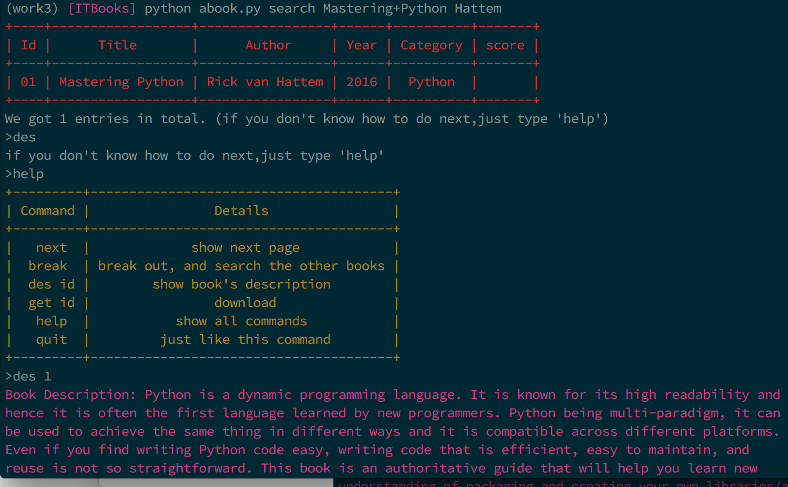

## ITBooks

### What is ITBooks?
The project uses scrapy to crawl data from some websites such as allitebooks,digilibraries,etc ,and stores it in sqlite3.
It can search and download some books that you need.

**Data source**

- [allitebooks](http://www.allitebooks.com/)  √
- ~~[taiwanebook](http://taiwanebook.ncl.edu.tw/zh-tw)~~
- [blah](http://blah.me/) √
- [digilibraries](http://digilibraries.com/)

You can use  python2.7+ or python3+ to run the script,Run:

``` shell
git clone https://github.com/howie6879/ITBooks
cd /ITBooks/ITBooks
python abook.py search Mastering+Python Hattem
```

The following content will show on screen:


### Usage:

```
  python abook.py search <title> <author>
  python abook.py title <title>
  python abook.py author <author>
```

#### Search

#### Command

#### download


Once the download is completed, you can read the book on your computer.

Enjoy reading time !

### TODO:

- Add more websites
- Batch download

### How to update?
[Update the data](docs/crawl.md)