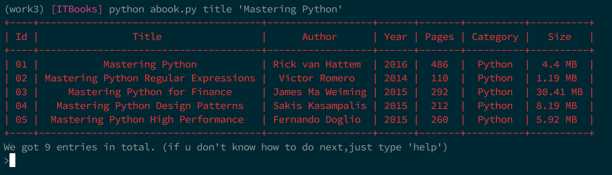
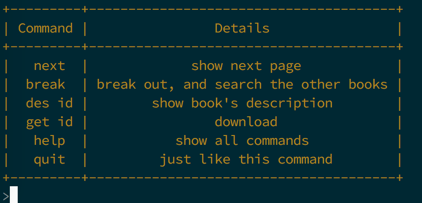
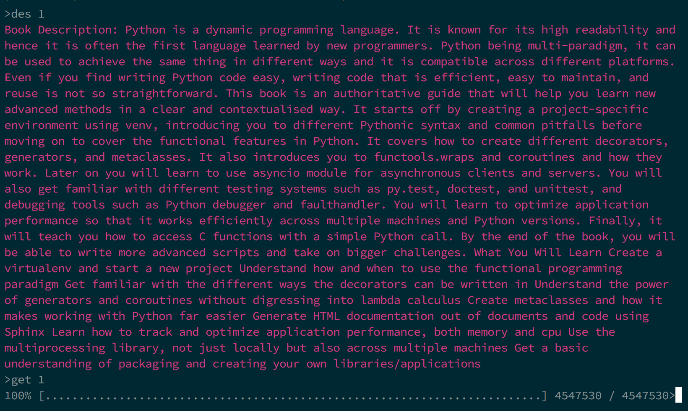

## ITBooks

### 说明：

`ITBooks`是一个查询和下载书籍的`python`脚本，目前只存储了`allitebooks`网站的书籍信息，因为想写成个人服务脚本，故使用`sqlite3`数据库，使用`scrapy`爬取信息，具体看`ITBooks/spider/allitebooks`，爬虫部分可直接运行从而进行书籍信息更新。添加爬虫只需要在`ITBooks/spider/allitebooks/spider`下新建一个scrapy的爬虫脚本即可，对于数据的存储，具体在`ITBooks/database`，当然，你可以直接新建一个库，然后新建一个查询类。

### 用法:
```
  abook.py search <title> <author>
  abook.py title <title>
  abook.py author <author>
```
#### Search

#### Command

#### download

好好享受阅读时光吧！
### 待完善:
- 添加更多网站支持
- 批量下载

